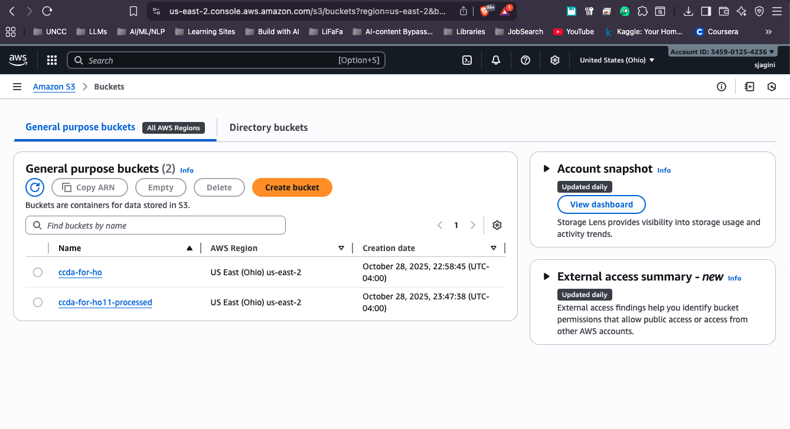
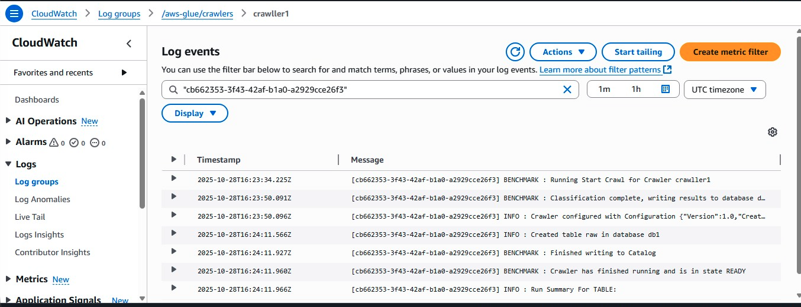
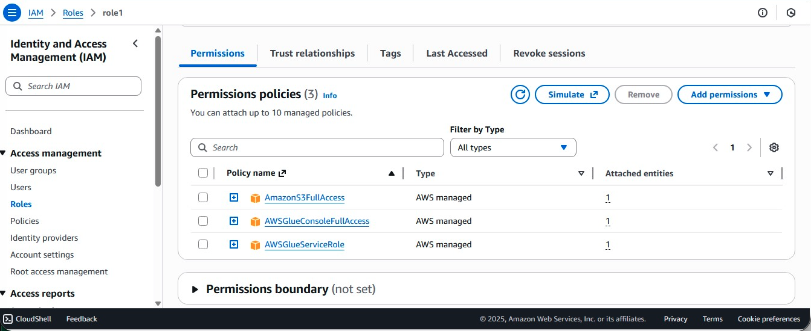

# AWS Athena E-Commerce Sales Exploration

## What This Repo Shows
This repository walks through a hands-on analytics exercise built on AWS fundamentals—S3 for storage, Glue for metadata, CloudWatch for observability, and Athena for querying. The journey covers staging raw files, structuring them into a catalog, and surfacing commercial insights with SQL.

## Data Source
- **Origin**: [Kaggle E-Commerce Sales Dataset](https://www.kaggle.com/datasets/thedevastator/unlock-profits-with-e-commerce-sales-data)
- **What’s Inside**: Transaction-level records detailing products, buyers, profit, discounts, and related attributes.

## Implementation Flow

1. **Store Data in S3**: Loaded the CSV exports into an S3 bucket.
2. **Set Up IAM Access**: Provisioned a role that grants Glue and S3 permissions.
3. **Catalog with Glue Crawler**: Ran a crawler to infer table structure automatically.
4. **Watch with CloudWatch**: Used logs and metrics to confirm crawler health.
5. **Analyze in Athena**: Issued SQL statements to surface performance metrics.

## AWS Building Blocks

### S3 Buckets

- `your-name-ecommerce-raw-data`: Houses the original CSV files.
- `your-name-ecommerce-processed-data`: Captures Athena output datasets.

### IAM Role

- **Role Name**: GlueCrawlerRole
- **Policies**:
  - AWSGlueServiceRole
  - AmazonS3FullAccess

### CloudWatch Monitoring

- Observed Glue crawler runs and reviewed their logs.
- Confirmed tables were populated correctly in the catalog.

## SQL Workloads

### Query 1: Cumulative Sales Over Time
**Intent**: Produce a daily running sales total for 2023.
**Why It Matters**: Reveals how revenue accumulates through the year.

[View Query](queries/query1.sql) | [View Results](results/q1.csv)

### Query 2: Geographic Hotspot Analysis
**Intent**: Surface states reporting the deepest profit losses.
**Why It Matters**: Highlights regions where spend or assortment needs attention.

[View Query](queries/query2.sql) | [View Results](results/q2.csv)

### Query 3: Discount Impact on Profitability
**Intent**: Examine profit behavior by sub-category at varying discount bands.
**Why It Matters**: Informs discount thresholds that preserve healthy margins.

[View Query](queries/query3.sql) | [View Results](results/q3.csv)

### Query 4: Top 3 Most Profitable Products
**Intent**: Rank the three profit leaders within every product category.
**Why It Matters**: Directs focus to high-performing SKUs for upsell and inventory planning.

[View Query](queries/query4.sql) | [View Results](results/q4.csv)

### Query 5: Monthly Growth Analysis
**Intent**: Measure month-over-month change in sales and profit.
**Why It Matters**: Tracks overall business velocity and seasonality shifts.

[View Query](queries/query5.sql) | [View Results](results/q5.csv)

## Takeaways to Capture Later
- [Populate with observations after executing the queries]
- Example: "Technology-related items deliver the strongest profit contribution."
- Example: "Discounts beyond 20% correlate with steep margin erosion."

## Hurdles and Fixes
- **Schema Mismatch**: Athena field names differed from the CSV headers.
  - **Fix**: Inspected the generated table definition before composing SQL.
- **Date Handling**: Source dates required format adjustments.
  - **Fix**: Leveraged CAST plus DATE_TRUNC for clean temporal groupings.

## Reproducing the Workflow

1. Clone this codebase locally.
2. Pull the dataset from Kaggle.
3. Follow the setup notes in `queries/` to configure AWS resources.
4. Load the CSVs into S3.
5. Run the Glue crawler to register the tables.
6. Execute the SQL scripts within Athena.

## Stack
- AWS S3
- AWS Glue
- AWS Athena
- AWS CloudWatch
- AWS IAM
- SQL

## Acknowledgments
- Dataset courtesy of Kaggle.
- Coursework guided by Professor Marco Vieira, UNC Charlotte.
